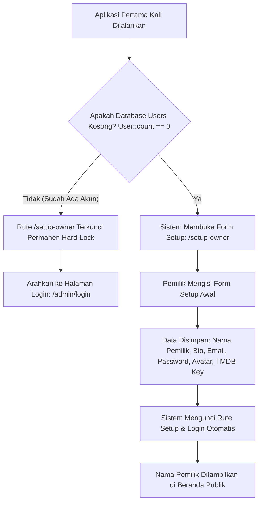
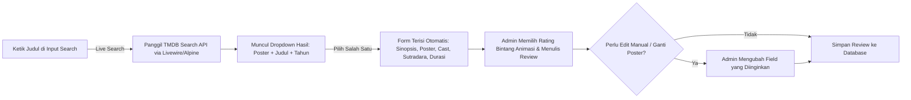
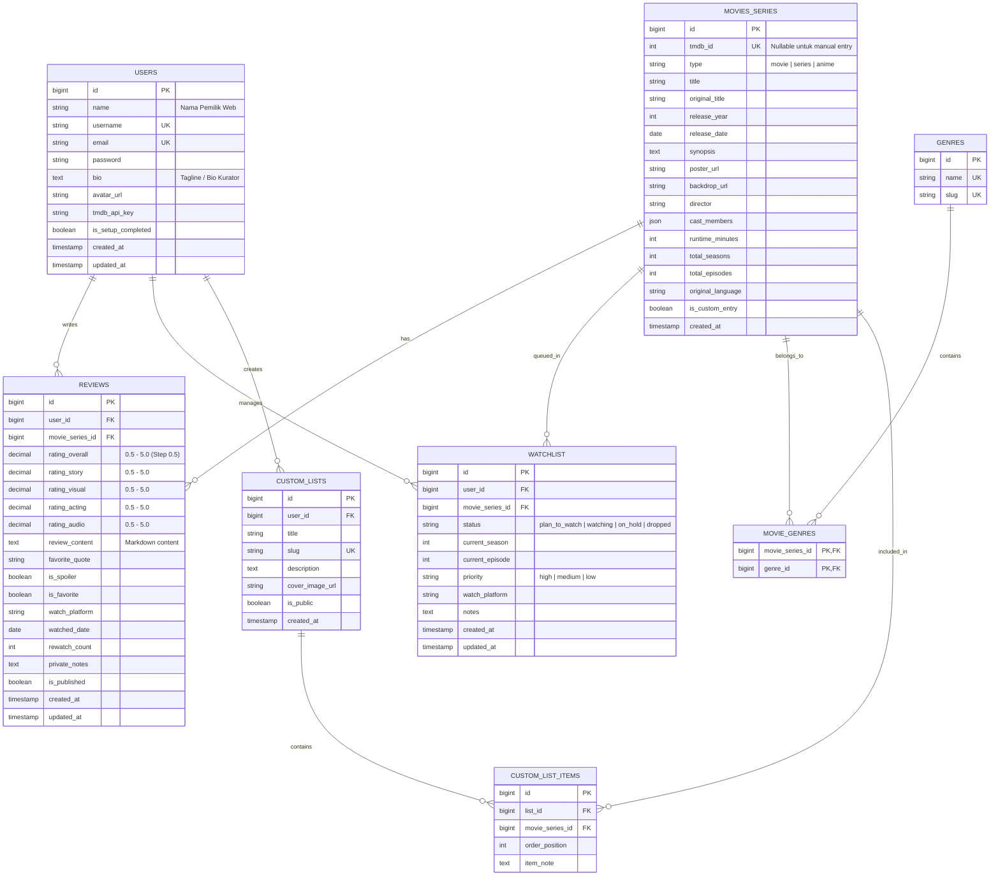
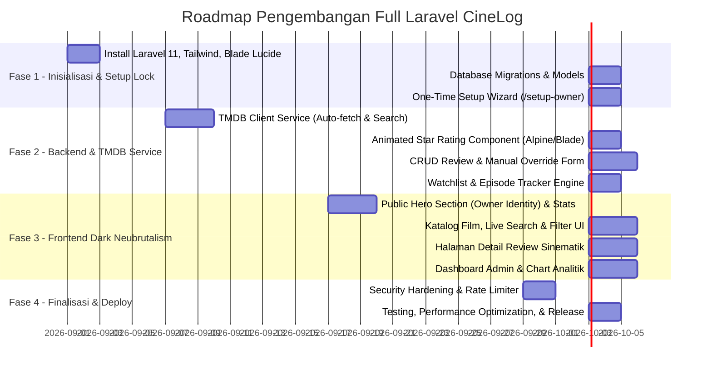

# Product Requirement Document (PRD)
## Personal Cinema & Series Review Platform (CineLog)

---

## 1. Executive Summary & Visi Produk

### 1.1 Latar Belakang
CineLog adalah platform portofolio dan katalog personal berbasis web untuk mengabadikan ulasan mendalam, penilaian rating beranimasi, daftar tontonan (*watchlist*), pelacak progres episode serial, dan statistik personal dari penikmat film/series. 

Website ini dirancang secara khusus untuk:
1. **Mempresentasikan Identitas Pemilik**: Setiap pengunjung yang membuka web langsung mengetahui identitas dan bio kurator film (nama pemilik yang didaftarkan pada inisiasi awal).
2. **Estetika Dark Mode Neubrutalism**: Tampilan berani (*bold*), modern, dan artistik dengan latar gelap pekat, garis tepi tegas (*thick high-contrast borders*), bayangan kaku berwarna neon (*hard offset drop shadows*), dan tipografi geometris.
3. **Kemudahan Manajemen Solo-Admin**: Dilengkapi integrasi **Open API (TMDB)** untuk pencarian dan *auto-fill* data film/poster/sinopsis dalam 1-klik, sistem rating bintang interaktif tanpa ketik angka, serta alur pendaftaran satu kali (*One-Time Setup*) yang aman dan otomatis terkunci.

---

## 2. Arsitektur Autentikasi & One-Time Setup Form (Solo Owner)

### 2.1 Mekanisme One-Time Setup Registrasi Pemilik
Karena platform ini didesain untuk **1 orang pemilik (Solo Admin)**, sistem tidak menyediakan registrasi publik bebas. Alur setup registrasi dirancang dengan mekanisme **First-Time Setup Lock**:



### 2.2 Form Setup Awal (*Initial Setup Form*)
Halaman `/setup-owner` hanya dapat diakses satu kali saat tabel `users` masih bernilai 0. Formulir ini memuat:
1. **Nama Lengkap / Display Name** *(Wajib)*: Nama yang akan tampil di seluruh halaman publik (misal: *"Reviewed by Alex Pratama"*).
2. **Username / Handle** *(Wajib)*: Handle unik (contoh: `@alexcinephile`).
3. **Bio / Tagline Kurator** *(Wajib)*: Deskripsi singkat tentang preferensi film/series (contoh: *"Cinephile & Sci-Fi enthusiast. Mendokumentasikan perjalanan menonton lebih dari 500 judul film & serial."*).
4. **Foto Profil / Avatar** *(Upload File / URL)*: Avatar pemilik dengan bingkai neubrutalism.
5. **Email Admin** *(Wajib)*: Email untuk kredensial login.
6. **Password & Konfirmasi Password** *(Wajib)*: Dianalisis dengan hashing `bcrypt` / `argon2id`.
7. **TMDB API Key** *(Opsional saat setup, dapat diatur kembali di pengaturan)*: Kunci API TMDB untuk fitur auto-fetch.

### 2.3 Middleware Proteksi Keamanan (`EnsureOwnerIsConfigured` & `PreventDuplicateSetup`)
- **`EnsureOwnerIsConfigured`**: Jika tabel `users` masih kosong, setiap akses ke area admin otomatis diarahkan ke `/setup-owner`.
- **`PreventDuplicateSetup`**: Jika akun sudah ada (`User::count() > 0`), akses ke `/setup-owner` langsung ditolak dengan respon `404 Not Found` atau *redirect* ke `/admin/login`.
- **Rate Limiting**: Rute login dibatasi maksimal 5 percobaan gagal per 15 menit menggunakan Laravel Rate Limiter bawaan.

---

## 3. Desain Sistem: Dark Mode Neubrutalism

Platform ini mengadopsi estetika **Neubrutalism (Neo-brutalism)** dengan basis **Dark Mode** secara menyeluruh (baik sisi publik maupun sisi admin).

```
┌─────────────────────────────────────────────────────────────┐
│  [★ 4.5] MASTERPIECE                                        │
│ ┌─────────────────────────────────────────────────────────┐ │
│ │                                                         │ │
│ │   DUNE: PART TWO (2024)                                 │ │
│ │   Director: Denis Villeneuve • Sci-Fi / Adventure       │ │
│ │                                                         │ │
│ │   "Sinematografi spektakuler dengan audio menggelegar." │ │
│ └─────────────────────────────────────────────────────────┘ │
│  Curated by Alex Pratama • [Blade Lucide Icon] 166 Mins     │
└─────────────────────────────────────────────────────────────┘
  ▲ Thick 2px/3px Border + Hard Offset Neon Shadow (4px 4px 0px)
```

### 3.1 Karakteristik Visual Neubrutalism (Dark Base)
1. **Palet Warna Gelap & Neon Accents**:
   - **Background Utama**: Deep Void Charcoal (`#0D0D12` / `#121218`)
   - **Background Card / Surface**: Dark Slate (`#1A1A24` / `#22222E`)
   - **Border Tebal Kontras Tinggi**: Garis tegas 2px hingga 3px solid (`border-2 border-slate-700` atau `border-2 border-white/20`)
   - **Hard Offset Shadow (Brutalist Signature)**:
     - Neon Purple Shadow: `shadow-[4px_4px_0px_0px_#A855F7]`
     - Cyber Amber Shadow: `shadow-[4px_4px_0px_0px_#F59E0B]`
     - Emerald Lime Shadow: `shadow-[4px_4px_0px_0px_#10B981]`
     - Electric Cyan Shadow: `shadow-[4px_4px_0px_0px_#06B6D4]`
     - Hot Pink / Crimson Shadow: `shadow-[4px_4px_0px_0px_#F43F5E]`
2. **Tipografi**:
   - **Headings & Display**: Font tebal geometris (*Space Grotesk*, *Cabinet Grotesk*, atau *Plus Jakarta Sans Bold*).
   - **Metadata, Tahun & Rating**: Monospace font bergaya retro-terminal (*JetBrains Mono* / *Space Mono*).
   - **Body Text**: Sans-serif bersih (*Inter* / *Plus Jakarta Sans*) dengan kontras teks putih-keabuan tinggi (`text-zinc-100`).
3. **Badge & Sticker Elements**:
   - Label genre, status, dan platform berbentuk *chunky badge* dengan sudut tegas/sedikit melengkung (*rounded-md*), garis tepi hitam/putih pekat, dan warna latar terang menyala.
4. **Standar Penggunaan Ikon**:
   - **MANDATORY**: Menggunakan pustaka ikon resmi **Blade Lucide Icons** (`<x-lucide-... />`) untuk seluruh antarmuka.
   - **STRICT RULE**: Dilarang menggunakan emoji keyboard sebagai representasi ikon fungsional UI (misalnya mengganti emoji ⭐ dengan `<x-lucide-star />`, 🎬 dengan `<x-lucide-film />`, 🔍 dengan `<x-lucide-search />`).

---

## 4. Integrasi Open API (TMDB) & Alur Tambah Film

### 4.1 Mengapa TMDB API?
- **Database Terlengkap**: Mendukung jutaan film layar lebar, serial TV barat, drama Asia, serial anime, hingga film lokal Indonesia.
- **Data Siap Pakai**: Judul asli & lokal, poster beresolusi tinggi, backdrop sinematik, sinopsis lengkap, sutradara, deretan aktor, genre, durasi, dan total season/episode.

### 4.2 Alur Penambahan & Edit (Auto-Fetch + Manual Override)


---

## 5. Komponen Rating Bintang Interaktif & Beranimasi

### 5.1 Mekanisme Input (Admin Side - Tanpa Ketik Angka Manual)
Formulir input ulasan menggunakan komponen rating bintang visual interaktif:
1. **Presisi Setengah Bintang (*Half-Star Precision 0.5 Step*)**:
   - Komponen 5 bintang SVG (skala 0.5 s/d 5.0 bintang, ekuivalen nilai 1 - 10).
   - Mengarahkan kursor ke belahan kiri bintang memilih `0.5`, dan belahan kanan memilih `1.0`.
2. **Efek Interaksi & Animasi**:
   - **Hover / Touch Drag**:
     - Bintang yang disorot membesar lembut (*scale 1.2x* dengan *spring bounce*).
     - Warna bintang menyala dalam nuansa *Cyber Amber Glow* (`#F59E0B`) dengan bayangan keras neubrutalism.
   - **Klik / Tap**:
     - Efek letupan (*pop pulse animation*) saat nilai terkunci.
     - Muncul partikel kilau (*sparkle animation*) saat memilih nilai sempurna 5.0 ★ (*Masterpiece*).
   - **Tombol Reset**: Ikon `<x-lucide-rotate-ccw class="w-4 h-4" />` untuk mengosongkan nilai jika terjadi salah klik.

### 5.2 Dynamic Tooltip & Live Badge Feedback
Saat kursor bergerak di atas bintang, teks label status otomatis tampil di samping komponen:
| Nilai Bintang | Label / Predikat | Aksen Warna Neubrutalism |
|---|---|---|
| **0.5 ★ - 1.0 ★** | *Unwatchable / Terrible* | Crimson Red (`bg-rose-500 text-black shadow-[2px_2px_0px_#fff]`) |
| **1.5 ★ - 2.0 ★** | *Bad / Disappointing* | Bright Orange (`bg-orange-500 text-black shadow-[2px_2px_0px_#fff]`) |
| **2.5 ★ - 3.0 ★** | *Decent / Mediocre* | Amber Yellow (`bg-amber-400 text-black shadow-[2px_2px_0px_#fff]`) |
| **3.5 ★ - 4.0 ★** | *Good / Recommended* | Emerald Lime (`bg-emerald-400 text-black shadow-[2px_2px_0px_#fff]`) |
| **4.5 ★** | *Exceptional / High Praise* | Electric Cyan (`bg-cyan-400 text-black shadow-[2px_2px_0px_#fff]`) |
| **5.0 ★** | *Masterpiece / Mahakarya* | Neon Gold Purple (`bg-yellow-300 text-black shadow-[3px_3px_0px_#A855F7]`) |

### 5.3 Rating Aspek Spesifik (Sub-Criteria Stars)
Admin juga dapat menilai aspek spesifik secara cepat menggunakan baris bintang mini yang sama:
- `<x-lucide-book-open />` **Story & Writing**: `[ ★ ★ ★ ★ ☆ ]` (4.0)
- `<x-lucide-users />` **Acting & Characters**: `[ ★ ★ ★ ★ ★ ]` (5.0)
- `<x-lucide-clapperboard />` **Visuals & Cinematography**: `[ ★ ★ ★ ★ ½ ]` (4.5)
- `<x-lucide-music />` **Sound & Score / OST**: `[ ★ ★ ★ ★ ☆ ]` (4.0)

---

## 6. Struktur Fitur Lengkap

### 6.1 Sisi Publik (Visitor Experience)
1. **Hero Header Personal**:
   - Menampilkan identitas pemilik yang diisi saat setup:
     - Avatar berbingkai tebal dengan efek bayangan neon.
     - Nama Pemilik (contoh: *"Alex Pratama's Cinema Vault"*).
     - Tagline personal & statistik tontonan ringkas (*"542 Movies Watched • 38 Series Completed • 4.2 Avg Rating"*).
2. **Katalog & Filter Interaktif**:
   - Filter Tipe: Semua, Film, Series, Anime.
   - Filter Genre: Action, Sci-Fi, Horror, Drama, Animation, dll.
   - Filter Rating Bintang: Slider / tombol filter 1★ s/d 5★.
   - Filter Tahun Rilis & Urutan (Terbaru Diulas, Rating Tertinggi, Tahun Terbaru).
   - Live Search bar dengan ikon `<x-lucide-search />`.
3. **Kartu Film (Neubrutalism Card)**:
   - Poster dengan border tebal 2px & hover lift effect (`hover:-translate-y-1 hover:shadow-[6px_6px_0px_#A855F7]`).
   - Badge tipe (*Movie / Series*), badge rating bintang emas, tahun rilis.
4. **Halaman Detail Ulasan**:
   - Banner backdrop sinematik dengan overlay gelap.
   - Metadata TMDB lengkap (Sutradara, Pemeran, Durasi, Total Episode).
   - Tampilan bintang rating utama dengan animasi pengisian bertahap (*staggered fill*).
   - Breakdown nilai per aspek (*Story, Visual, Acting, Sound*).
   - Teks ulasan lengkap (didukung format Markdown).
   - Label spoiler dengan tombol buka/tutup ulasan (*Spoiler Alert Toggle*).
   - Kutipan favorit (*Favorite Quote*) dalam blok kutipan neubrutalism.
5. **Watchlist Publik & Pelacak Progres**:
   - Menampilkan daftar film yang berencana ditonton atau serial yang sedang diikuti (*e.g. Currently on Season 2 Ep 5*).

---

### 6.2 Sisi Manajemen (Admin Dashboard & CRUD)

1. **Dashboard Analitik**:
   - Kartu metrik neubrutalism (Total Film, Total Series, Rata-rata Rating, Estimasi Total Jam Menonton).
   - Grafik tren menonton bulanan (ditenagai Chart.js dengan aksen neon).
   - Diagram sebaran genre dan distribusi rating bintang.
   - Tombol Aksi Cepat: *Tambah Review via TMDB*, *Tambah ke Watchlist*.
2. **Review & Log Management (CRUD)**:
   - Tabel data dengan filter instan dan pencarian.
   - Form Tambah/Edit Review dengan integrasi TMDB live search, animated star rating, markdown editor, upload custom poster, private notes, dan spoiler toggle.
3. **Watchlist Management**:
   - Pengelompokan status: *Plan to Watch*, *Watching* (dengan tombol counter episode `+` / `-`), *Completed*, *Dropped*.
   - Tingkat prioritas (*High, Medium, Low*).
   - Tombol 1-Klik: *"Pindahkan ke Review / Mark as Watched"*.
4. **Curated Lists / Koleksi Khusus**:
   - Pembuatan daftar bertema (contoh: *"Top 10 Mindfuck Movies"*, *"Best of 2026"*).
5. **Pengaturan Profil & Kunci API**:
   - Mengubah Nama Pemilik, Bio, Avatar, Password, dan TMDB API Key.

---

## 7. Pilihan Tech Stack (Full Laravel)

| Lapisan / Komponen | Teknologi yang Digunakan | Penjelasan |
|---|---|---|
| **Backend Framework** | **Laravel 11 (PHP 8.2+)** | Framework PHP modern, cepat, aman, dan memiliki ekosistem lengkap. |
| **Frontend / Templating** | **Laravel Blade + Alpine.js** *(atau Laravel Livewire 3)* | Templating server-side yang cepat dikombinasikan dengan reaktivitas instan untuk live search TMDB dan animasi rating bintang. |
| **Styling & CSS** | **Tailwind CSS v3 / v4** | Memudahkan pembuatan komponen Dark Mode Neubrutalism (`border-2`, `shadow-[4px_4px_0px_#...]`, `bg-zinc-900`). |
| **Pustaka Ikon (Icon Library)** | **Blade Lucide Icons (`blade-ui-kit/blade-lucide-icons`)** | Standar ikon SVG modern, konsisten, dan ringan (tanpa emoji keyboard). |
| **Database** | **PostgreSQL** / **MySQL** / **SQLite** | Fleksibel untuk deployment lokal maupun cloud (Supabase/Neon/VPS). |
| **ORM & Seeder** | **Eloquent ORM** | Model relasi data, migrations, dan seeder bawaan Laravel. |
| **Data Fetching Client** | **Laravel HTTP Client (`Http::withToken(...)`)** | Konsumsi TMDB API secara aman dari server-side tanpa mengekspos API Key ke client. |
| **Markdown Parser** | **League CommonMark** (Laravel Markdown) | Render ulasan ulasan teks dalam format markdown ke HTML secara aman (*sanitized*). |
| **Chart & Grafik** | **Chart.js** | Visualisasi data analitik dashboard dengan styling neon neubrutalism. |

---

## 8. Pemetaan Pustaka Ikon (Blade Lucide Icons)

Untuk menjaga konsistensi desain dan meniadakan emoji keyboard, berikut pemetaan ikon resmi yang digunakan:

| Fungsi UI | Komponen Blade Icon | Tampilan Visual |
|---|---|---|
| **Rating Bintang** | `<x-lucide-star />` & `<x-lucide-star-half />` | Ikon bintang SVG presisi |
| **Film / Movies** | `<x-lucide-film />` | Pita roll film sinematik |
| **Series / TV Show** | `<x-lucide-tv />` | Monitor / Televisi |
| **Pencarian** | `<x-lucide-search />` | Kaca pembesar |
| **Filter** | `<x-lucide-sliders-horizontal />` | Tuas filter |
| **Watchlist / Bookmark** | `<x-lucide-bookmark />` & `<x-lucide-bookmark-check />` | Pita penanda buku |
| **Durasi Waktu** | `<x-lucide-clock />` | Jam dinding |
| **Tanggal Rilis / Nonton** | `<x-lucide-calendar />` | Kalender |
| **Sutradara** | `<x-lucide-clapperboard />` | Clapperboard sutradara |
| **Pemeran / Cast** | `<x-lucide-users />` | Profil orang |
| **Kutipan Ulasan** | `<x-lucide-quote />` | Tanda kutip |
| **Spoiler Warning** | `<x-lucide-alert-triangle />` | Segitiga peringatan |
| **Tambah Data** | `<x-lucide-plus />` | Tanda tambah |
| **Edit Data** | `<x-lucide-edit-3 />` | Pensil edit |
| **Hapus Data** | `<x-lucide-trash-2 />` | Tempat sampah |
| **Admin / Profil** | `<x-lucide-user />` & `<x-lucide-shield-check />` | Perisai keamanan & profil |
| **Reset Rating** | `<x-lucide-rotate-ccw />` | Panah putar ulang |

---

## 9. Skema Database (Database Schema)



---

## 10. Roadmap & Tahapan Implementasi



---

## 11. Kesimpulan

Dengan integrasi spesifikasi ini:
1. **Full Laravel Stack**: Arsitektur handal, mudah di-deploy di hosting/VPS mana saja, serta performa rendering server-side yang cepat.
2. **Dark Mode Neubrutalism**: Tampilan visual yang unik, atraktif, dan berkarakter kuat tanpa emoji acak, melainkan menggunakan icon library resmi (*Blade Lucide Icons*).
3. **One-Time Registration Form**: Nama dan identitas Anda sebagai kurator utama terekam sejak awal dan otomatis terpampang di beranda publik, sementara form setup terkunci rapat setelah pembuatan akun pertama.
4. **Input Rating Nyaman**: Tanpa perlu mengetik angka, pengisian skor ulasan dilakukan melalui komponen bintang interaktif yang beranimasi halus dengan presisi setengah bintang (*0.5 step*).
